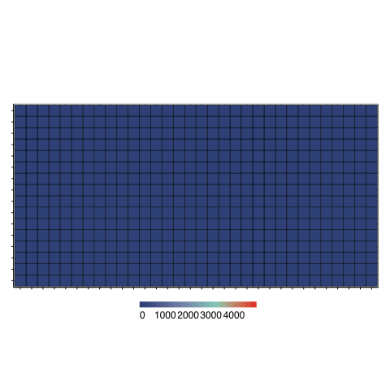
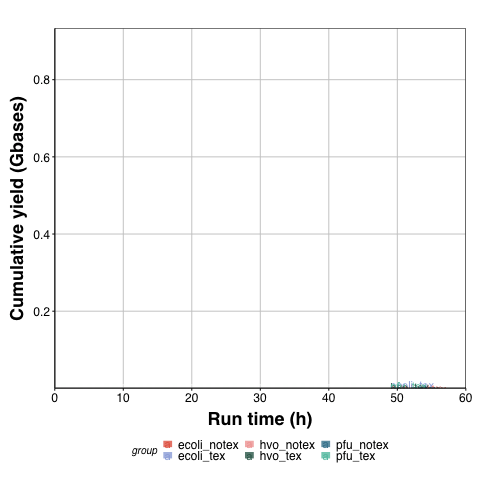

Exploring prokaryotic transcription, operon structures, rRNA maturation
and modifications using Nanopore-based native RNA sequencing
================
Felix Grünberger<sup>1</sup>, Robert Knüppel<sup>2</sup>, Michael
Jüttner<sup>2</sup>, Martin Fenk<sup>1</sup>, Andreas
Borst<sup>3</sup>, Robert Reichelt<sup>1</sup>, Winfried
Hausner<sup>1</sup>, Jörg Soppa<sup>3</sup>,
<a href="https://orcid.org/0000-0002-0522-843X">Sébastien
Ferreira-Cerca<sup>2°</sup></a>, and
<a href="https://orcid.org/0000-0002-0570-2517">Dina
Grohmann<sup>1°</sup></a>  

<sup>1</sup> Department of Biochemistry, Genetics and Microbiology,
Institute of Microbiology, Single-Molecule Biochemistry Lab &
Biochemistry Centre Regensburg, University of Regensburg,
Universitätsstraße 31, 93053 Regensburg, Germany

<sup>2</sup> Biochemistry III – Institute for Biochemistry, Genetics and
Microbiology, University of Regensburg, Universitätsstraße 31, 93053
Regensburg, Germany.

<sup>3</sup> Goethe University, Institute for Molecular Biosciences,
Max-von-Laue-Str. 9, D-60438, Frankfurt, Germany

<sup>°</sup> Corresponding authors

  - [Information about this
    repository](#information-about-this-repository)
  - [Data generation](#data-generation)
  - [Data analysis](#data-analysis)
      - [Navigation](#navigation)
      - [Demultiplexing using
        <span>`poreplex`</span>](#demultiplexing-using-poreplex)
      - [Basecalling using `guppy`](#basecalling-using-guppy)
      - [Mapping using <span>`minimap2`</span>](#mapping-using-minimap2)
          - [Mapping of reads to reference
            genomes](#mapping-of-reads-to-reference-genomes)
          - [Mapping of reads to spike-in
            control](#mapping-of-reads-to-spike-in-control)
      - [Poly(A)-tail analysis using
        <span>`nanopolish`</span>](#polya-tail-analysis-using-nanopolish)
      - [Gene expression analysis using
        `featurecounts`](#gene-expression-analysis-using-featurecounts)
      - [Summarise metadata information on single-read
        level](#summarise-metadata-information-on-single-read-level)
      - [Quality control](#quality-control)
          - [Analysis of raw reads](#analysis-of-raw-reads)
          - [Analysis of mapped reads](#analysis-of-mapped-reads)
          - [Run statistics](#run-statistics)
      - [Detection of transcriptional units
        (TU)](#detection-of-transcriptional-units-tu)
      - [Annotation of transcription start sites
        (TSS)](#annotation-of-transcription-start-sites-tss)
      - [Annotation of transcription termination sites
        (TTS)](#annotation-of-transcription-termination-sites-tts)
      - [Single-read analysis](#single-read-analysis)
          - [mRNA](#mrna)
          - [rRNA](#rrna)
      - [Modified base detection](#modified-base-detection)
          - [<span>`Tombo`</span>](#tombo)
          - [Pileup mapping assignments](#pileup-mapping-assignments)
  - [Data availability](#data-availability)
      - [Raw sequencing files](#raw-sequencing-files)
      - [Additional data](#additional-data)
  - [License](#license)
  - [References](#references)

<!-- README.md is generated from README.Rmd. Please edit that file -->

-----

## Information about this repository

This is the repository for the manuscript “Exploring prokaryotic
transcription, operon structures, rRNA maturation and modifications
using Nanopore-based native RNA sequencing”, which can be found on
<a href = "https://www.biorxiv.org/content/10.1101/2019.12.18.880849v2">bioRxiv</a>.
It contains a description of the bioinformatical tools used to process
native RNA sequencing data and the downstream analysis mostly based on
custom [Rscripts](Rscripts).

The repository is currently actively developed.

[](https://gist.github.com/cheerfulstoic/d107229326a01ff0f333a1d3476e068d)

## Data generation

Libraries for Nanopore sequencing were prepared from poly(A)-tailed RNAs
according to the SQK-RNA001 Kit protocol (Oxford Nanopore, Version:
DRS\_9026\_v1\_revP\_15Dec2016) with minor modifications for barcoded
libraries. In this case, Agencourt AMPure XP magnetic beads (Beckman
Coulter) in combination with 1 µl of RiboGuard RNase Inhibitor (Lucigen)
were used instead of the recommended Agencourt RNAclean XP beads to
purify samples after enzymatic reactions. For the barcoded libraries,
the RTA adapter was replaced by custom adapters described in
<https://github.com/hyeshik/poreplex> and reverse transcription (RT) was
performed in individual tubes for each library. After RT reactions, cDNA
was quantified using the Qubit DNA HS assay kit (Thermo Fisher
Scientific) and equimolar amounts of DNA for the multiplexed samples
were used in the next step for ligation of the RNA Adapter (RMX) in a
single tube. Subsequent reactions were performed according to the
protocols recommended by ONT. The libraries were sequenced on a MinION
using R9.4 flow cells and subsequently, FAST5 files were generated using
the recommended script in MinKNOW.

## Data analysis

Before starting a sequencing run, different running options can be
selected in MinKNOW. In case reads are stored in multi-FAST5-containing
files (e.g. 4000 reads per file), files can be converted to single-read
FAST5 files using the
[ont\_fast5\_api](https://github.com/nanoporetech/ont_fast5_api), as
some workflows
(e.g. [`nanopolish`](https://nanopolish.readthedocs.io/en/latest/) and
[`tombo`](https://nanoporetech.github.io/tombo/)) rely on single-FAST5
files for further analysis.  
After a run, reads are stored in two folders (*fast5\_failed*,
*fast5\_passed*). To prevent actual good reads from beeing discarded we
**included all reads from both folders** in the following steps of the
analysis.  
First, we converted multi-FAST5-files with the `multi_to_single_fast5`
command from the
[ont\_fast5\_api](https://github.com/nanoporetech/ont_fast5_api):

``` bash
#!/bin/bash

# set input_path, save_path, search in all folders for fast5 files, set number of threads
multi_to_single_fast5 \
    --input_path <path folder containing multi_read_fast5 files> \
    --save_path <path to folder where single_read fast5 files will be output> \
    --recursive <recursively search sub-directories> \
    --threads <number of CPU threads to use>
```

The output will be single-read FAST5 files in the *save\_path* folder
with one subfolder per multi-read input file.

### Navigation

We managed our folders in the following way:

``` bash
Native_RNAseq_Microbes/
├── data/
|   ├── genome_data
|   ├── tidy_data
|   ├── summary_data
|   ├── mapped_data
|   ├── guppy_data
|   ├── fastq_data
|   ├── coverage_data
|   ├── meme_data
|   ├── enolase_data
|   ├── poly_data
|   ├── tombo_data
|   └── operon_data
├── Rscrips
├── figures
├── tables/
|   ├── tss_tables
|   ├── tts_tables
|   ├── tu_tables
|   └── counts_tables
├── LICENSE
└── README
```

Relative paths in the custom `R` and `bash` scripts are included for the
complete analysis.

### Demultiplexing using [`poreplex`](https://github.com/hyeshik/poreplex)

Multiplexed libraries (*how to* is described here:
<https://github.com/hyeshik/poreplex>) can be demultiplexed using
[`poreplex`](https://github.com/hyeshik/poreplex). Following this
approach four direct RNA sequencing libraries can be barcoded, pooled
and sequenced together. `Poreplex` can demultiplex the libraries into
separate folders with:

``` bash
#!/bin/bash

# trim adapters, basecall using albacore, de-multiplex, create symbolic fast5 link, increase number of working processes, sort reads to folders according to barcodes
poreplex \
    -i <path/to/fast5> \
    -o <path/to/output> \
    --trim-adapter <trim 3′ adapter sequences from FASTQ outputs> \
    --barcoding <sort barcoded reads into separate outputs> \
    --basecall <call the ONT albacore for basecalling on-the-fly> \
    --symlink-fast5 <create symbolic links to FAST5 files in output directories even when hard linking is possible> \
    --parallel <number of worker processes>
```

Reads can be basecalled automatically during demultiplexing using
`albacore`, the outdated basecaller of ONT. As we observed dramatic
differences in the detected read qualities and number of reads that can
be mapped, we chose to only sort the reads based on `poreplex` and used
`guppy` (Version 3.0.3) for basecalling. In this case the `poreplex` can
be shortened to: `poreplex -i <input> -o <output> --barcoding
--parallel`.

### Basecalling using `guppy`

Demultiplexed raw FAST5 files and other raw FAST5 files that have not
been barcoded (raw MinKNOW output) can be basecalled (*translated* in
FASTQ data) using `guppy`, the ONT-developed basecaller (available in
the ONT Community). We used version 3.0.3 for basecalling of all of our
reads:

``` bash
#!/bin/bash

guppy_basecaller \
    --flowcell FLO-MIN106 <flowcell-version> \
    --kit SQK-RNA001 <sequencing-kit> \
    --input $input <path to input FAST5 files> \
    --save_path $output <path to output> \
    --recursive <search input folders recursively> \
    --reverse_sequence yes <as RNA is sequenced from 3´to 5´> \
    --hp_correct 1 <enable homopolymer correction> \
    --enable_trimming <trim RNA reads> \
    --cpu_threads_per_caller <set number of threads> \
    --calib_detect <detect RCS spike in>
```

Demultiplexed files from *fast5\_failed* and *fast5\_passed* folders can
be basecalled seperately. Final output files from `guppy` are merged
with:

``` bash
#!/bin/bash

# FASTQ
### e.g. for BC1 failed and passed folders
cat $dir/guppy_data/BC1_fail/*.fastq $dir/guppy_data/BC1_pass/*.fastq > $dir/fastq_data/BC1_combined.fastq

# Sequencing summary
### e.g. for BC1 failed and passed folders
cat $dir/guppy_data/BC1_fail/sequencing_summary.txt $dir/guppy_data/BC1_pass/sequencing_summary.txt > $dir/summary_data/BC1_sequencing_summary.txt
```

### Mapping using [`minimap2`](https://github.com/lh3/minimap2)

#### Mapping of reads to reference genomes

FAST5 passed and FAST5 failed reads that have been demultiplexed using
`poreplex` and basecalled using `guppy` can now be mapped to the
reference genomes using [`minimap2`](https://github.com/lh3/minimap2)(Li
[2018](#ref-Li2018)). Release 2.17-r941 was used for our analysis.
Output alignments in the SAM format were generated with the recommended
options for noisy Nanopore Direct RNA-seq (-ax splice, -uf, -k14) and
also with (1) -p set to 0.99, to return primary and secondary mappings
and (2) with –MD turned on, to include the MD tag for calculating
mapping identities. Alignment files were further converted to bam files,
sorted and indexed using `SAMtools` (Li et al. [2009](#ref-Li2009)).
Strand-specific wig and bigwig files were finally created using
`bam2wig` (Version 1.5, <https://github.com/MikeAxtell/bam2wig>).

``` bash
#!/bin/bash

# set file paths
dir=<path_to_basedir>
genome_fasta=<path_to_fasta_file>(downloaded from NCBI)
out_dir=$dir/mapped_data

# map using minimap2 | convert using samtools and bam2wig
for file in $dir/fastq_data/*_combined.fastq # path to all of the merged .fastq files
do 
  filename_extended=$file##*/
  filename=$filename_extended%%.*
  minimap2 -p 0.99 -ax splice -k14 --MD -uf $genome_fasta $file > $out_dir/$filename".sam" # map using minimaps2
  samtools flagstat $out_dir/$filename".sam" > $out_dir/$filename"_stats.txt" # calculate mapping statistics
  samtools view -bS $out_dir/$filename".sam" -o $out_dir/$filename".bam" # sam to bam
  samtools sort $out_dir/$filename".bam" -o $out_dir/$filename"_sorted.bam" # bam to sorted bam 
  samtools index $out_dir/$filename"_sorted.bam" # index sorted bam file 
  samtools view -h -F 16 $out_dir/$filename".bam" > $out_dir/$filename"_forward.bam" # create strand specific bam files
  samtools view -h -f 16 $out_dir/$filename".bam" > $out_dir/$filename"_reverse.bam" # strand specific bam files
  samtools sort $out_dir/$filename"_forward.bam" -o $out_dir/$filename"_forward_sorted.bam" # sort 
  samtools sort $out_dir/$filename"_reverse.bam" -o $out_dir/$filename"_reverse_sorted.bam" # sort
  samtools depth -a -d 0 $out_dir/$filename"_forward_sorted.bam" >  $out_dir/$filename"_forward_sorted_depth.txt" # calculate number of reads for each position in a strand specific way (no threshold set) and write to bed-like txt file
  samtools depth -a -d 0 $out_dir/$filename"_reverse_sorted.bam" > $out_dir/$filename"_reverse_sorted_depth.txt" # calculate number of reads for each position in a strand specific way (no threshold set) and write to bed-like txt file
  /Users/felixgrunberger/Documents/scripts/bam2wig $out_dir/$filename"_sorted.bam" # create wig files from bam files, all reads
  /Users/felixgrunberger/Documents/scripts/bam2wig -s top $out_dir/$filename"_sorted.bam" # create wig files from bam files, top strand
  /Users/felixgrunberger/Documents/scripts/bam2wig -s bottom $out_dir/$filename"_sorted.bam" # create wig files from bam files, bottom strand
  echo $filename "mapping finished" 
done
```

#### Mapping of reads to spike-in control

`Guppy` filters out the calibration reads (make sure to enable
`--calib_detect`) that can be mapped to the enolase gene to perform
quality control analysis.

``` bash
#!/bin/bash

# set file paths
dir=<path_to_basedir>
genome_fasta=<path_to_enolase_file>
out_dir=$dir/mapped_data

# before mapping merge failed and passed files
cat $dir/guppy_data/BC1_fail/calibration_strands/*.fastq $dir/guppy_data/BC1_pass/calibration_strands/*.fastq > $dir/enolase_data/BC1_calibration.fastq

# map using minimap2
for file in $dir/enolase_data/*calibration.fastq
do 
  filename_extended=$file##*/
  filename=$filename_extended%%.*
  minimap2 -ax splice -k14  --MD -uf $genome_fasta $file > $out_dir/$filename".sam"
  samtools flagstat $out_dir/$filename".sam" > $out_dir/$filename"_stats.txt"
  samtools view -bS $out_dir/$filename".sam" | samtools sort -o $out_dir/$filename"_sorted.bam"
  samtools index $out_dir/$filename"_sorted.bam"
  samtools depth -a -d 0 $out_dir/$filename"_sorted.bam" > $out_dir/$filename"_depth.txt"
  echo $filename "mapping finished"!  
done
```

### Poly(A)-tail analysis using [`nanopolish`](https://nanopolish.readthedocs.io/en/latest/quickstart_polya.html)

Poly(A) tail length was estimated by nanopolish following the
recommended workflow (Version 0.10.2,
<https://nanopolish.readthedocs.io/en/latest/quickstart_polya.html>)
(Loman, Quick, and Simpson [2015](#ref-Loman2015)).  
The workflow includes indexing of the reads using the `nanopolish index`
module and mapping of the reads using `minimap2`. The poly(A)-tail
length estimator can then be run on mapped files with `nanopolish
polya`, with genome fasta, fastq read file and mapped bam file as input.
The output is stored in a .tsv file that was analyzed using a [custom R
script](Rscripts/poly_a_tail_analysis.R).

### Gene expression analysis using `featurecounts`

We calculated transcript abundances for long-read Nanopore native RNA
reads using `featurecounts`(Liao, Smyth, and Shi [2019](#ref-Liao2019a))
with the following command in `R`:

``` r
featureCounts(allowMultiOverlap = T, 
              files = input_bam_file, 
              annot.ext = input_gff_file, 
              isGTFAnnotationFile = T, 
              GTF.featureType = name, <name argument was used multiple times for CDS, rRNA and tRNAs>
              GTF.attrType = "ID", 
              isLongRead = T)
```

Number of counts for each gene were added to the metadata information,
the `Rscript` for the complete analysis can be found in the next
section.

### Summarise metadata information on single-read level

For each data set one matrix including raw-read, mapped-read and count
information was prepared using the [`tidy_data`](Rscripts/tidy_data.R)
script. Following files are needed as input:

  - sequencing\_summary.txt from `guppy`  
  - genome fasta file
  - genome gff file  
  - Sorted .bam file from `minimap2` output

Files are stored as `R` files, but can also be exported as tables
(commented in the code). As each line represents one single read or
sometimes one read refers to multiple lines (multimapping of rRNA reads
to multiple loci) these tables can become quite large.

### Quality control

Quality control of sequencing runs was performed at the raw-read level
(unmapped reads from `guppy` output) and at the mapped-read level (after
`minimap2` mapping and `tidy_data` conversion).

#### Analysis of raw reads

Raw read plots and statistics were generated from `guppy`s
*sequencing\_summary.txt* files and are shown in the
[`raw_read_plots`](Rscripts/raw_read_plots.R) script.  
To control for problems during loading (air bubbles, …) an interactive
heatmap output of MinKNOW can be rebuild using following script:
[`animated_qc`](Rscripts/animated_qc.R).  


In a similar way the total cumulative throughput over time can be
animated using the [’animted\_qc\`](Rscripts/animated_qc.R) script:  


#### Analysis of mapped reads

Mapped read analysis was performed using the
[`mapped_read_plots`](Rscripts/mapped_read_plots.R) script. The number
of reads mapping to different genomic features was calculated with
`featurecounts`, visualized using the
[`featurecounts_categories`](Rscripts/featurecounts_categories.R) script
and are stored in the [`counts_table`](tables/counts_tables/) files.

#### Run statistics

Supplementary Table 1 in the manuscript based on raw and mapped features
was calculated using the following script:
[`calculate_run_statistics`](Rscripts/calculate_run_statistics.R).

### Detection of transcriptional units (TU)

The detection of transcriptional units is a two-step process:

  - Collapsing of overlapping reads to TU-clusters is described in
    [`tu_cluster_generation.R`](Rscripts/tu_cluster_generation.R)  
  - Splitting of of clusters based on sequencing depth on the 3´end is
    described in
    [`tu_subcluster_annotation`](Rscripts/tu_subcluster_annotation.R)

The clusters for each genome are saved in the
[*tu\_tables*](tables/tu_tables/) section.  
Comparison to databases (manuscript Supplementary Figures 10a-c) were
plotted using the
[`tu_comparison_database`](Rscripts/tu_comparison_database.R) script.

Prerequisites for the TU annotation, like sequencing of full-lenght
transcripts and coverage bias towards 3´ end was evaluated based on the
scripts [`fraction_full_length`](Rscripts/fraction_full_length.R) and
[`coverage_drop_3prime`](Rscripts/coverage_drop_3prime.R).

### Annotation of transcription start sites (TSS)

The detection of transcription start sites (TSS) was based on the
detection of transcriptional units and is described in
[`transcription_start_sites`](Rscripts/transcription_start_sites.R).  
A transcriptional start site table for each organism can be found here:
[*tss\_tables*](tables/tss_tables/)

### Annotation of transcription termination sites (TTS)

Transcription termination sites were estimated in a similar way as start
sites and is described in the
[`transcription_termination_sites`](Rscripts/transcription_termination_sites.R)
script.  
A transcriptional termination site table for each organism can be found
here: [*tts\_tables*](tables/tts_tables/)

### Single-read analysis

Single-read analysis was used to look at long 3´UTRs and processing
events on the 16S and 23S rRNAs during ribosomal maturation.

#### mRNA

Examples are shown in Supplementary Fig. 8 of the manuscript and were
plotted using the
[`single_reads_pilin_hvo`](Rscripts/single_reads_pilin_hvo.R) and
[`single_reads_alba_pfu`](Rscripts/single_reads_alba_pfu.R) scripts.

#### rRNA

Reads for plotting of Figure 4 were plotted using the
[`single_reads_rrnac`](Rscripts/single_reads_rrnc.R) script.

### Modified base detection

#### [`Tombo`](https://nanoporetech.github.io/tombo/)

We used `Tombo` (Version 1.5, <https://nanoporetech.github.io/tombo>) to
identify modified bases based on a comparison to a theoretical
distribution (*de novo* model) and based on the comparison to a
reference data set (sample-compare model)(compare Stoiber et al.
[2016](#ref-Stoiber2016)). The different steps include `preprocessing`,
`resquiggling` and `plotting` of the raw signals at specific genomic
coordinates and are well-described in the documentation.  
The probability of modified bases was calculated using the
`detect_modification` *de\_novo* command, written to *.wig* files using
the `text_output browser_files` command and added to the `plot
genome_locations` plot using the
[`tombo_fractions_positions`](Rscripts/tombo_fractions_positions.R)
script. For Fig. 6b the signals were calculated for both samples
(wildtype and deletion mutant) and compared using the
`control-fast5-basedirs` and `overplot Boxplot` option. For Fig 6c a
reference data set was created by sorting the reads mapping to the 16S
rRNA based on the position of the read start (before or after gene
start), thereby dividing the data set in reads that belong to mature and
unprocessed 16S rRNAs (script see here:
[`filter_rrna_reads_for_tombo`](Rscripts/filter_rrna_reads_for_tombo.R)).
The selected reads can be extracted using the custom Rscript or using
the `fast5_subset` module of the
[ont\_fast5\_api](https://github.com/nanoporetech/ont_fast5_api). Minion
read names of reads that fulfill certain criteria therefore have to be
written to a `read_id_list`.  
The two different models (*de novo* and sample-compare using non-mature
16S reads as a reference set) were applied to the complete 16S,
base-modification-probabilities extracted from the tombo output and
plotted using a custom
[`tombo_16S_heatmap`](Rscripts/tombo_16S_heatmaps.R) script.

#### Pileup mapping assignments

For calculating the frequency of correct, deleted and wrong nucleotides
at a genomic position the function pileup from the Rsamtools package was
used (<https://rdrr.io/bioc/Rsamtools/>). Plots were generated using the
[`pileup_mod_bases`](Rscripts/pileup_mod_bases.R) R script. The results
were compared to known modification sites in 16S rRNA for *Escherichia
coli* (Boccaletto et al. [2018](#ref-Boccaletto2018)) and *Haloferax
volcanii* (Grosjean et al. [2008](#ref-Grosjean2008)). Given the high
degree of conservation of the modifying enzymes in archaea and because
there was no reference set available for *Pyrococcus furiosus*, the
results were compared to the five modified positions that are described
for *H. volcanii* (910, 1352, 1432, 1450/1451 correspond to 938,
1379,1469,1486/1487 in *P. furiosus*).

## Data availability

### Raw sequencing files

The raw sequencing data in fast5 format will be submitted to the NCBI
sequence read archive
(<a href="https://www.ncbi.nlm.nih.gov/sra">SRA</a>) under BioProject
accession number XXX.

### Additional data

-----

## License

This project is under the general MIT License - see the
[LICENSE](LICENSE) file for details

## References

<div id="refs" class="references hanging-indent">

<div id="ref-Boccaletto2018">

Boccaletto, Pietro, Magdalena A. MacHnicka, Elzbieta Purta, Pawek
Pitkowski, Blazej Baginski, Tomasz K. Wirecki, Valérie De Crécy-Lagard,
et al. 2018. “MODOMICS: A database of RNA modification pathways. 2017
update.” *Nucleic Acids Research*.
<https://doi.org/10.1093/nar/gkx1030>.

</div>

<div id="ref-Grosjean2008">

Grosjean, Henri, Christine Gaspin, Christian Marck, Wayne A. Decatur,
and Valérie de Crécy-Lagard. 2008. “RNomics and Modomics in the
halophilic archaea Haloferax volcanii: Identification of RNA
modification genes.” *BMC Genomics* 9: 1–26.
<https://doi.org/10.1186/1471-2164-9-470>.

</div>

<div id="ref-Li2018">

Li, Heng. 2018. “Minimap2: Pairwise alignment for nucleotide sequences.”
*Bioinformatics*. <https://doi.org/10.1093/bioinformatics/bty191>.

</div>

<div id="ref-Li2009">

Li, Heng, Bob Handsaker, Alec Wysoker, Tim Fennell, Jue Ruan, Nils
Homer, Gabor Marth, Goncalo Abecasis, and Richard Durbin. 2009. “The
Sequence Alignment/Map format and SAMtools.” *Bioinformatics* 25 (16):
2078–9. <https://doi.org/10.1093/bioinformatics/btp352>.

</div>

<div id="ref-Liao2019a">

Liao, Yang, Gordon K. Smyth, and Wei Shi. 2019. “The R package Rsubread
is easier, faster, cheaper and better for alignment and quantification
of RNA sequencing reads.” *Nucleic Acids Research*.
<https://doi.org/10.1093/nar/gkz114>.

</div>

<div id="ref-Loman2015">

Loman, Nicholas J., Joshua Quick, and Jared T. Simpson. 2015. “A
complete bacterial genome assembled de novo using only nanopore
sequencing data.” *Nature Methods* 12 (8): 733–35.
<https://doi.org/10.1038/nmeth.3444>.

</div>

<div id="ref-Stoiber2016">

Stoiber, Marcus H, Joshua Quick, Rob Egan, Ji Eun Lee, Susan E Celniker,
Robert Neely, Nicholas Loman, Len Pennacchio, and James B Brown. 2016.
“De novo Identification of DNA Modifications Enabled by Genome-Guided
Nanopore Signal Processing.” *bioRxiv*, 094672.
<https://doi.org/10.1101/094672>.

</div>

</div>
